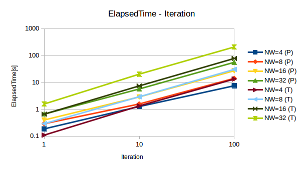

# Comparison between Multiprocessing and Multithreading in Python

Some peaple said that *numpy* in python releases GIL, which is an eval in python, so that *multithreading with numpy* is actually faster than or equal to *multiprocssing with numpy* in speed performance. Thus, I run benchmark since in my experience, *multiprocessing* is bettern than *multithreading* in any case even if loading data task which is IO-bound one.

# Environment and Experiment settings

The followings are the settings of this expeirments.

- OS: Ubuntu 16.04
- CPU: 1 x Intel(R) Core(TM) i7-4930K CPU @ 3.40GHz
- Memory: 64 GB
- python: 2.7.12
- numpy: 1.11.3

Experiments is just compute *numpy.dot* betwen the same ndarray for *iteration*-times and use *n_workers*-times workers; each worker implemented are either *multiprocessing* or *multithreading*. I did not compute some times of the same experiment for calculating stats; mean or std. See the codes under the same directory in more details.

# Results

|Iter|NW=4 (P)|NW=8 (P)|NW=16 (P)|NW=32 (P)|NW=4 (T)|NW=8 (T)|NW=16 (T)|NW=32 (T)|
|:---:|:---:|:---:|:---:|:---:|:---:|:---:|:---:|:---:|
|1|0.1856639385|0.2890818119|0.3975839615|0.6593680382|0.1086130142|0.2902991772|0.6544570923|1.5660309792|
|10|1.2579870224|1.5657150745|2.8634121418|5.6623220444|1.3241181374|2.8979771137|7.3525941372|20.1881780624|
|100|7.4596788883|14.0612437725|27.0309708118|55.6111371517|13.2753710747|30.3149459362|77.333316803|207.013168097|

# Discussion
Contrary to my initial understanding, when the number of workers is 4 and the number of iteration is 1, *mutithreading* is faster than *multiprocessing*, and when the number of workers is 8 and the number of iteration is 1, *mutithreading* is almost the same as *multiprocessing*, which complies with someone's arguments. Thus, if the logic per a thread is not complex enough and the number of workers is relatively small, *multithreading* x *numpy* peforms well. However, if the logic per a thread is complex, one should use *multiprocessing* x *numpy* even if using *numpy* (or other library which explicitly releases GIL) is used.
